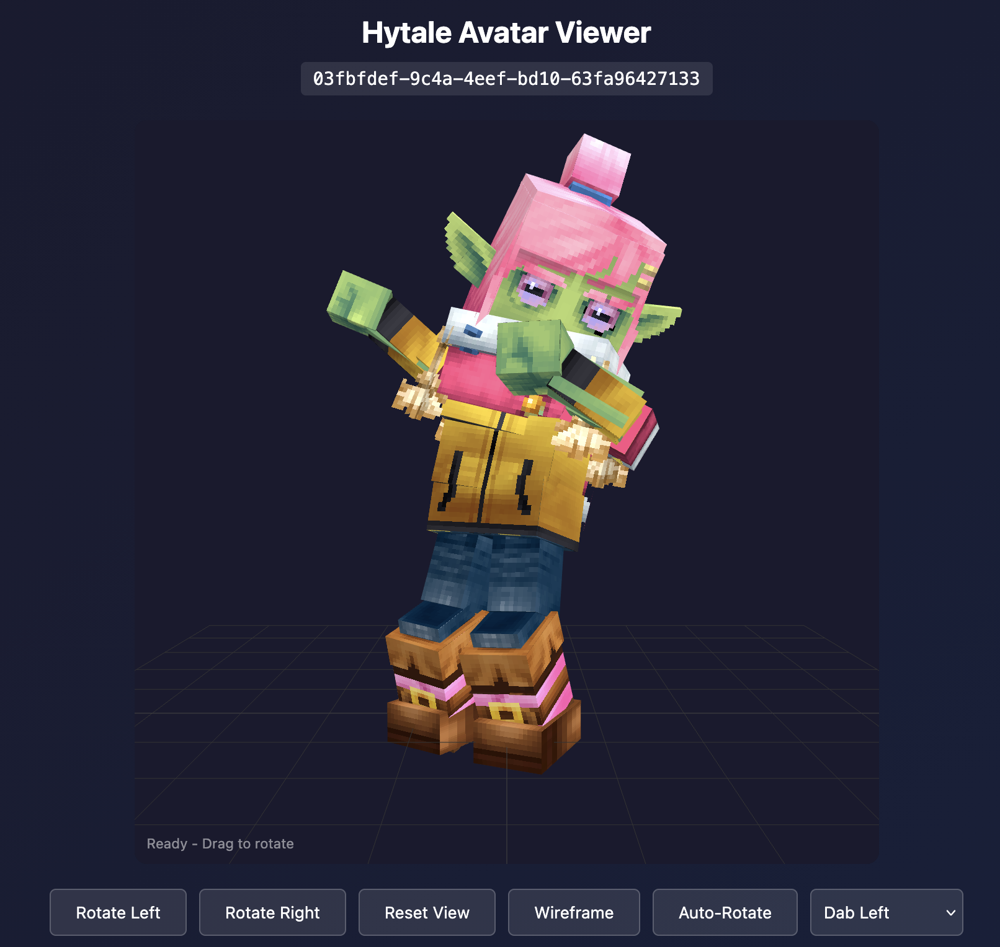
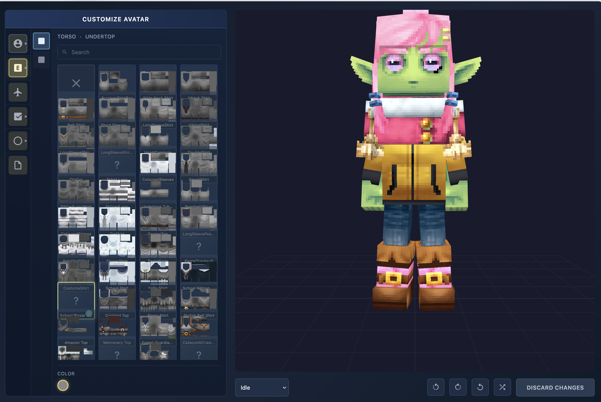

# Hytale Auth Server

**Authentication server for custom Hytale F2P setup.**

This server handles authentication requests from both the game client (via the F2P launcher) and dedicated game servers. It implements the Hytale authentication protocol with Ed25519 JWT signing.

> **Warning**: This is an experimental project for educational purposes. Use at your own risk.

## Screenshots

<details>
<summary>Click to view screenshots</summary>

### Admin Dashboard


### Avatar Viewer


### Character Customizer


### Head Embed Test


### Video Demo
[](https://youtube.com/shorts/aDqYWr8rcwg)

</details>

**Live Demo:** [Avatar Customizer](https://sessions.sanasol.ws/customizer/03fbfdef-9c4a-4eef-bd10-63fa96427133)

## Public Test Server

**You don't need to run your own auth server!** A public test server is available at `sanasol.ws` and is used by default in all related projects.

### Quick Test (No Setup Required)

1. **Download the pre-built launcher**: [Hytale F2P Launcher v2.0.2b](https://github.com/amiayweb/Hytale-F2P/releases/tag/v2.0.2b)
2. **Connect to the public game server**: `ht.vboro.de:5720`

That's it! No auth server or game server setup needed for testing.

- **All cosmetics unlocked** - full access to character customization
- **Cosmetics saved by username** - your skin/cosmetic choices persist between sessions

> **Note**: There is no password authentication - anyone can use any username. If you use a username someone else has used, you'll see their cosmetics. Use a unique username for testing.

### Build from Source

Alternatively, use the [Hytale F2P Launcher source](https://github.com/amiayweb/Hytale-F2P) and [hytale-server-docker](https://github.com/sanasol/hytale-server-docker) with default settings - they're pre-configured to use `sanasol.ws` with dual auth support (both official and F2P players can play together).

> **Note**: The public server is for testing purposes. For production use or privacy, set up your own server using this repository.

## Related Projects

This is part of a complete Hytale F2P setup:

| Project | Description |
|---------|-------------|
| [hytale-auth-server](https://github.com/sanasol/hytale-auth-server) | Authentication server + DualAuthPatcher (this repo) |
| [Hytale F2P Launcher](https://github.com/amiayweb/Hytale-F2P) | Game launcher with dual auth support |
| [hytale-server-docker](https://github.com/sanasol/hytale-server-docker) | Dedicated server Docker image |

## DualAuthPatcher

This repository contains the **authoritative source** for `DualAuthPatcher.java` - the bytecode patcher that enables true hybrid authentication on Hytale servers.

- **Dual-Auth**: Supports both official `hytale.com` and custom F2P servers.
- **Omni-Auth**: Supports **Decentralized Authentication** by trusting user-provided authorities with embedded JWKs.
- **Two-Level Cache**: Efficiently manages network and transient keys with an optimized cache system.
- Location: [`patcher/`](patcher/)
- Documentation: [`patcher/README.md`](patcher/README.md)
- Other projects (hytale-server-docker, Hytale-F2P) download from here

## Requirements (for running your own server)

> **Skip this section** if you're using the public `sanasol.ws` test server.

- Docker and Docker Compose
- A domain with **4-16 characters**
  - Default: `auth.sanasol.ws` (14 chars, public test server)
  - Examples: `auth.example.com`, `my.server.io`, `game.host.net`
- DNS records pointing to your server
- (Optional) `Assets.zip` from the game for cosmetics

> **Note**: Both client and server patchers support variable-length domains from 4 to 16 characters. The unified endpoint approach routes all traffic to `https://{domain}` (no subdomains needed).

## Quick Start (Own Server)

### 1. Clone the repository

```bash
git clone https://github.com/sanasol/hytale-auth-server.git
cd hytale-auth-server
```

### 2. Configure your domain

Edit `compose.yaml` and set your domain:

```yaml
environment:
  DOMAIN: "auth.yourdomain.com"  # Your auth domain (4-16 characters)
labels:
  - "traefik.http.routers.auth.rule=Host(`auth.yourdomain.com`)"
```

### 3. Set up DNS records

Create a DNS A record pointing to your server IP:

- `auth.yourdomain.com` (or your chosen domain)

> **Note**: The unified endpoint approach uses a single domain. No need for multiple subdomains (sessions., account-data., telemetry.) - the auth server handles all routes on one domain.

### 4. (Optional) Add Assets.zip for cosmetics

Copy `Assets.zip` from your Hytale game installation to enable all cosmetics:

```bash
cp /path/to/Hytale/Assets.zip ./assets/
```

The Assets.zip is typically found in:
- Windows: `%LOCALAPPDATA%\Hytale\release\package\game\latest\Client\Assets.zip`
- macOS: `~/Library/Application Support/Hytale/release/package/game/latest/Client/Assets.zip`

### 5. Start the server

```bash
docker compose up -d
```

### 6. Verify it's working

```bash
curl https://sessions.yourdomain/health
# Should return: {"status":"ok","server":"hytale-auth","domain":"yourdomain"}
```

## Configuration

### Environment Variables

| Variable | Default | Description |
|----------|---------|-------------|
| `DOMAIN` | `sanasol.ws` | Your domain (4-16 characters) |
| `PORT` | `3000` | Server port |
| `DATA_DIR` | `/app/data` | Directory for persistent data |
| `ASSETS_PATH` | `/app/assets/Assets.zip` | Path to Assets.zip for cosmetics |
| `REDIS_URL` | `redis://localhost:6379` | Redis/Kvrocks connection URL |
| `ADMIN_PASSWORD` | `changeme` | Password for admin dashboard |

### Persistent Data

The server stores the following data in the `data/` directory:

- `jwt_keys.json` - Ed25519 key pair for JWT signing (auto-generated)
- `user_data.json` - User skin/cosmetic preferences
- `head-cache/` - Cached head embed images

**Important**: Keep `jwt_keys.json` backed up! If you lose it, all existing tokens become invalid.

## Features

### Admin Dashboard

Access at `https://sessions.yourdomain/admin` (requires `ADMIN_PASSWORD`).

- View active sessions and connected players
- Monitor server statistics
- Set custom display names for game servers
- View player avatars with embedded head previews

### Avatar Viewer

View any user's avatar in 3D with animations:
```
https://sessions.yourdomain/avatar/{uuid}
```

Features:
- 3D character rendering from `.blockymodel` files
- Animation playback (Idle, Walk, Run, Jump, Emotes, etc.)
- Skin tone and body type support
- Cosmetic parts rendering (hair, clothes, accessories)

### Avatar Customizer

Interactive character customization:
```
https://sessions.yourdomain/customizer/{uuid}
```

Features:
- Browse all cosmetic categories (Head, Torso, Arms, Legs, Capes)
- Live preview of cosmetic changes
- Color variations for supported items
- Animation preview

### Head Embed

Embeddable player head images for use in admin panels, forums, etc:
```
https://sessions.yourdomain/avatar/{uuid}/head?bg=black
```

Query parameters:
- `bg` - Background color: `transparent`, `white`, `black`, or hex color (e.g., `#ff0000`)
- `nocache` - Set to `1` to bypass cache

Features:
- Server-side caching with disk persistence
- Proper HTTP caching headers (ETag, Last-Modified)
- Multiple background color options

Test page available at: `https://sessions.yourdomain/test/head`

### Head Pre-render Worker

A background service that pre-renders avatar heads for all active players using headless Chrome with Puppeteer. This ensures head images are cached before users request them, improving load times on the admin dashboard.

Features:
- Runs in a separate Docker container
- Uses WebGL software rendering (SwiftShader) - no GPU required
- Processes players in batches to avoid overloading the server
- Shares cache directory with main auth server

Configuration (environment variables):
| Variable | Default | Description |
|----------|---------|-------------|
| `AUTH_SERVER_URL` | `http://hytale-auth:3000` | Auth server URL for rendering |
| `REDIS_URL` | `redis://kvrocks:6666` | Redis/Kvrocks connection |
| `HEAD_CACHE_DIR` | `/app/data/head-cache` | Cache directory path |
| `BG_COLOR` | `black` | Background color for renders |
| `BATCH_SIZE` | `5` | Heads to render per batch |
| `LOOP_INTERVAL` | `60000` | Milliseconds between render loops |

## Endpoints

<details>
<summary>Click to view all endpoints</summary>

### Authentication (Client → Auth Server)

| Endpoint | Method | Description |
|----------|--------|-------------|
| `/.well-known/jwks.json` | GET | JWKS for JWT signature verification |
| `/game-session/new` | POST | Create new game session |
| `/game-session/child` | POST | Create child session (used by launcher) |
| `/game-session/refresh` | POST | Refresh session tokens |
| `/game-session` | DELETE | Delete/logout session |

### Server Join Flow (Client ↔ Server ↔ Auth Server)

| Endpoint | Method | Description |
|----------|--------|-------------|
| `/game-session/authorize` | POST | Authorization grant for server connection |
| `/server-join/auth-grant` | POST | Alias for authorization grant |
| `/server-join/auth-token` | POST | Token exchange with certificate binding |
| `/game-session/exchange` | POST | Alias for token exchange |

### Account Data

| Endpoint | Method | Description |
|----------|--------|-------------|
| `/my-account/game-profile` | GET/POST | Get/update user profile |
| `/my-account/cosmetics` | GET | Get unlocked cosmetics |
| `/my-account/skin` | POST | Save user skin preferences |
| `/my-account/get-launcher-data` | GET | Get launcher-specific data |
| `/my-account/get-profiles` | GET | Get user profiles |

### Profile Lookup (Game Server → Auth Server)

Used by game servers for commands like `/ban`, `/kick`, etc.

| Endpoint | Method | Description |
|----------|--------|-------------|
| `/profile/uuid/{uuid}` | GET | Look up player profile by UUID |
| `/profile/username/{username}` | GET | Look up player profile by username |

**Headers for username lookup:**
- `X-Server-Audience` - Server audience ID (returns players on that server first)

### Avatar & Cosmetics

| Endpoint | Method | Description |
|----------|--------|-------------|
| `/avatar/{uuid}` | GET | 3D avatar viewer page |
| `/avatar/{uuid}/head` | GET | Embeddable head image (PNG) |
| `/avatar/{uuid}/model` | GET | Avatar model data API |
| `/customizer/{uuid}` | GET | Avatar customizer UI |
| `/cosmetics/list` | GET | List all available cosmetics |
| `/cosmetics/item/{category}/{itemId}` | GET | Get specific cosmetic item |
| `/asset/{path}` | GET | Serve assets from Assets.zip |
| `/test/head` | GET | Head embed test page |

### Admin Dashboard (Protected)

Requires `ADMIN_PASSWORD` environment variable. Token stored in browser localStorage.

| Endpoint | Method | Description |
|----------|--------|-------------|
| `/admin` | GET | Admin dashboard HTML page |
| `/admin/login` | POST | Login with password, returns token |
| `/admin/verify` | GET | Verify if token is valid |
| `/admin/stats` | GET | Lightweight server statistics |
| `/admin/servers` | GET | Paginated server list with players |
| `/admin/sessions` | GET | All active sessions |
| `/admin/server-name` | POST | Set display name for a server |

**Protected endpoints require header:** `X-Admin-Token: {token}`

**Query params for `/admin/servers`:**
- `page` - Page number (default: 1)
- `limit` - Items per page (default: 10, max: 50)

### Utility

| Endpoint | Method | Description |
|----------|--------|-------------|
| `/health` | GET | Health check |
| `/bugs/create` | POST | Bug report endpoint (no-op) |
| `/feedback/create` | POST | Feedback endpoint (no-op) |

</details>

## Local Development

For local testing without HTTPS:

```bash
docker compose -f compose.simple.yaml up -d
```

This exposes the server on `http://localhost:3000`.

## Complete Setup Guide

### Running Everything Together

1. **Start the auth server** (this repo):
   ```bash
   cd hytale-auth-server
   docker compose up -d
   ```

2. **Start a dedicated game server** ([hytale-server-docker](https://github.com/sanasol/hytale-server-docker)):
   ```bash
   cd hytale-server-docker
   # Edit compose.yaml to set HYTALE_AUTH_DOMAIN to your domain
   docker compose up -d
   ```

3. **Launch the game** ([Hytale F2P Launcher](https://github.com/amiayweb/Hytale-F2P)):
   - Download from [releases](https://github.com/amiayweb/Hytale-F2P/releases/tag/v2.0.2b)
   - Or build from source:
   ```bash
   git clone https://github.com/amiayweb/Hytale-F2P.git
   cd Hytale-F2P
   npm install
   npm start
   ```

The launcher will:
1. Patch the game client to use your domain instead of `hytale.com`
2. Fetch authentication tokens from your auth server
3. Launch the game with proper authentication

## Troubleshooting

### "Domain length mismatch"

Your domain must be 4-16 characters. The patchers support variable-length domains within this range.

### "JWT signature verification failed"

Make sure the auth server's Ed25519 keys are persisted. If the keys change, existing tokens become invalid. Check that `data/jwt_keys.json` exists and is not being recreated on each restart.

### Cosmetics not loading

1. Check that `Assets.zip` is in the `assets/` directory
2. Check the server logs for cosmetics loading messages
3. Verify the zip file is valid: `unzip -l assets/Assets.zip | grep Cosmetics`

## Technical Notes

### Asset Format (Research)

The viewer parses Hytale's asset format:
- `.blockymodel` - 3D model definitions with bone hierarchy
- `.blockyanim` - Animation keyframe data
- Greyscale textures with gradient-based coloring
- Character cosmetic configuration from `CharacterCreator/*.json`

This is a reverse-engineering research project to understand Hytale's asset format.

## License

MIT License - See [LICENSE](LICENSE)
